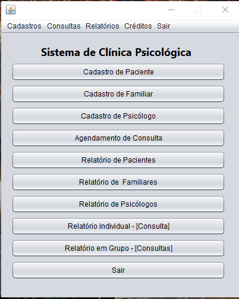
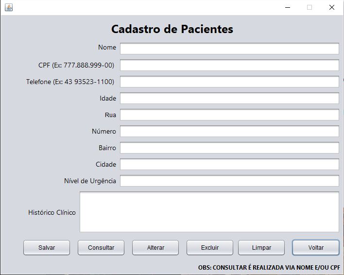
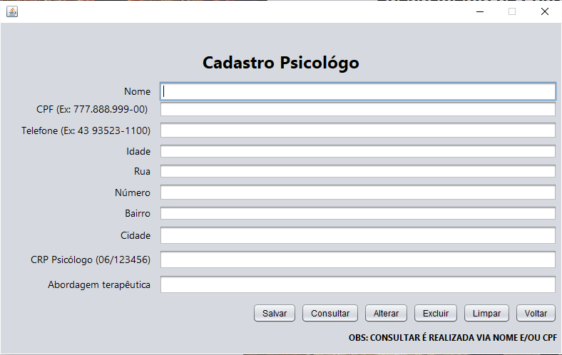
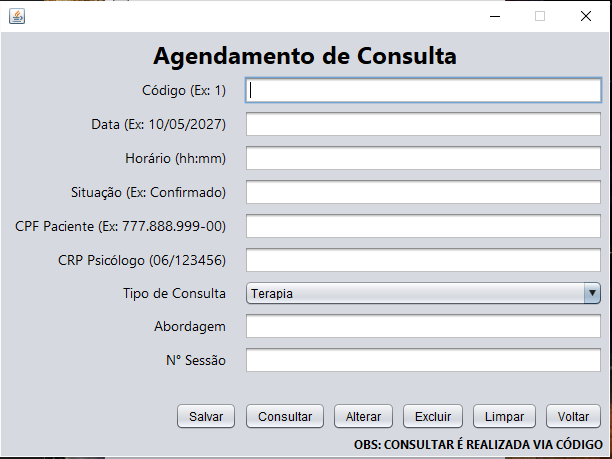
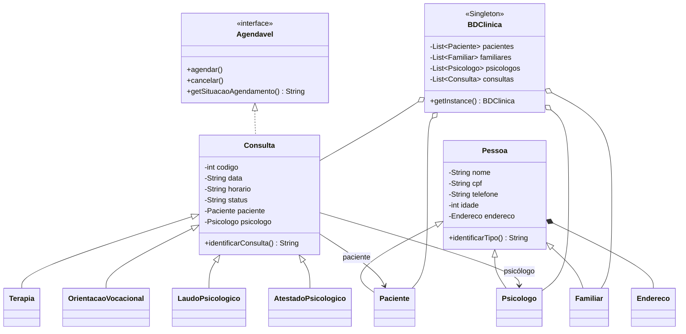

<<<<<<< HEAD
<div align="center">

# 🧠 PsyClinic Manager

### Sistema de Gestão para Clínica Psicológica


Aplicação desktop para gerenciamento de pacientes, familiares, psicólogos, consultas e relatórios de uma clínica psicológica, desenvolvida em Java Swing e executada na IDE Apache NetBeans 24.

</div>

---

## 📖 Sobre o projeto

O **PsyClinic Manager** foi desenvolvido como projeto final da disciplina de **Linguagem de Programação Orientada a Objetos**, no curso de **Análise e Desenvolvimento de Sistemas da Universidade Tecnológica Federal do Paraná — UTFPR**.

A aplicação simula rotinas de uma clínica psicológica por meio de uma interface gráfica construída com **Java Swing**. O projeto foi desenvolvido, executado e testado na IDE **Apache NetBeans 24**, utilizando o **Apache Maven** para gerenciamento e compilação.

O sistema foi estruturado para demonstrar, na prática, os principais fundamentos da Programação Orientada a Objetos. O trabalho recebeu **nota máxima na avaliação final**.

> **Observação:** os dados são mantidos em memória durante a execução. O projeto não utiliza banco de dados.

---

## 🖥️ Demonstração

### Tela principal

<p align="center">
  
</p>

### Cadastros

<p align="center">
  
  
</p>

### Gerenciamento de consultas

<p align="center">
  
</p>

---

## ✨ Funcionalidades

- Cadastro e gerenciamento de pacientes;
- Cadastro e gerenciamento de familiares;
- Cadastro e gerenciamento de psicólogos;
- Registro de diferentes tipos de consulta;
- Agendamento e cancelamento de atendimentos;
- Consulta da situação de um agendamento;
- Emissão de relatórios individuais;
- Emissão de relatórios em grupo;
- Validação dos dados informados pelo usuário;
- Tratamento de erros por meio de exceções personalizadas;
- Navegação pelas funcionalidades em interface gráfica.

---

## 🧩 Conceitos de POO aplicados

O projeto demonstra a aplicação dos seguintes conteúdos:

- **Abstração e modelagem de entidades**;
- **Encapsulamento** por meio de atributos privados, getters e setters;
- **Herança**, com especializações de `Pessoa` e `Consulta`;
- **Polimorfismo**, aplicado na identificação dos diferentes tipos de pessoa e consulta;
- **Sobrecarga** de construtores e métodos;
- **Sobrescrita** de métodos nas classes derivadas e na implementação da interface;
- **Interface**, por meio de `Agendavel`;
- **Reflexividade entre objetos relacionados**, acessando dados de objetos associados;
- **Composição**, como a relação entre `Pessoa` e `Endereco`;
- **Singleton**, aplicado à classe `BDClinica`;
- **CRUD em memória** com coleções do tipo `List`;
- **Exceções personalizadas**;
- Uso de `throw`, `throws`, `try`, `catch` e `finally`;
- Separação de responsabilidades entre as classes.

---

## 🏗️ Estrutura conceitual



---

## 📁 Estrutura do repositório

```text
PsyClinic-Manager/
├── docs/
│   └── screenshots/
│       ├── tela-principal.png
│       ├── cadastro-paciente.png
│       ├── cadastro-psicologo.png
│       └── gerenciamento-consultas.png
├── src/
│   └── main/
│       └── java/
│           ├── Agendavel.java
│           ├── BDClinica.java
│           ├── Pessoa.java e suas especializações
│           ├── Consulta.java e suas especializações
│           ├── classes de exceção personalizadas
│           ├── FormPrincipal.java
│           ├── formulários de cadastro e relatórios
│           └── arquivos .form do NetBeans
├── .gitattributes
├── .gitignore
├── nbactions.xml
├── pom.xml
└── README.md
```

---

## 🚀 Como executar

### Pré-requisitos

Antes de iniciar, tenha instalado:

- **Java JDK**, na versão definida no arquivo `pom.xml`;
- **Apache Maven**;
- **Apache NetBeans 24**, IDE utilizada no desenvolvimento, execução e testes.

### Executando pelo Apache NetBeans 24

1. Abra o **Apache NetBeans 24**;
2. Selecione **File → Open Project**;
3. Escolha a pasta do projeto;
4. Aguarde o Maven carregar as configurações;
5. Clique em **Run Project** ou pressione `F6`.

A classe principal configurada para iniciar a aplicação é `FormPrincipal`.

### Executando pelo terminal

Na pasta raiz do projeto, execute:

```bash
mvn clean compile
java -cp target/classes FormPrincipal
```

Para gerar o arquivo executável do projeto:

```bash
mvn clean package
```

Após a compilação, execute o JAR gerado com:

```bash
java -jar target/psyclinic-manager-1.0.0.jar
```

---

## ⚠️ Tratamento de exceções

O sistema utiliza exceções personalizadas para impedir operações inválidas e apresentar mensagens mais claras ao usuário, incluindo:

- `ConsultaInvalidaException`;
- `EntradaInvalidaException`.

A interface `Agendavel` define os comportamentos de agendar, cancelar e consultar a situação do atendimento, permitindo que as implementações tratem regras específicas de negócio.

---

## 🛠️ Tecnologias utilizadas

- **Java**;
- **Java Swing**;
- **Programação Orientada a Objetos**;
- **Apache Maven**;
- **Apache NetBeans 24 — IDE**;

---

## 🎓 Contexto acadêmico

- **Curso:** Análise e Desenvolvimento de Sistemas;
- **Instituição:** Universidade Tecnológica Federal do Paraná — UTFPR;
- **Disciplina:** Linguagem de Programação Orientada a Objetos;
- **Tipo:** Projeto final;
- **Resultado:** nota máxima.

---

## 👨‍💻 Autor

**Micael Marinho Souza**

---

## 📚 Finalidade

Este repositório foi publicado para fins de **portfólio, aprendizado e consulta acadêmica**. O código pode servir como referência para estudantes que estejam aprendendo Programação Orientada a Objetos em Java.

---
=======
# PsyClinic-Manager
Sistema desktop de gestão para clínicas psicológicas, desenvolvido em Java, Java Swing e Programação Orientada a Objetos. Projeto criado, executado e testado na IDE Apache NetBeans 24.
>>>>>>> e305c6c602a06c773c3bfa046c1d8a326573e8f8
